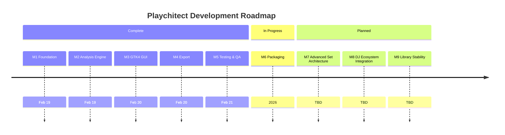

# Playchitect — Development Roadmap

## Status Overview

| Milestone | Description | Status | Completed |
|---|---|---|---|
| 1 | Foundation & Core Refactoring | ✅ Complete | 2026-02-19 |
| 2 | Intelligent Analysis Engine | ✅ Complete | 2026-02-19 |
| 3 | GTK4 GUI Development | ✅ Complete | 2026-02-20 |
| 4 | Export & Integration | ✅ Complete | 2026-02-20 |
| 5 | Testing & Quality Assurance | ✅ Complete | 2026-02-21 |
| 6 | Packaging & Distribution | 🚧 In progress | — |
| 7 | Advanced Set Architecture | 📅 Planned | — |
| 8 | DJ Ecosystem Integration | 📅 Planned | — |
| 9 | Library Management & Stability | 📅 Planned | — |

---

## ✅ Milestone 1 — Foundation & Core Refactoring (Complete)

**Goal**: Extract the original `create_random_playlists.py` script into a proper, tested, modular package.

**Delivered**:
- `playchitect/core/audio_scanner.py` — recursive audio file discovery, 11 formats, 92% coverage
- `playchitect/core/metadata_extractor.py` — BPM + metadata extraction with caching, 61% coverage
- `playchitect/cli/commands.py` — Click-based `scan` and `info` commands
- Pre-commit hooks: ruff, ty, pytest-unit, cli-smoke-test
- GitHub Actions CI/CD
- uv package management, `pyproject.toml`

See [`milestones/milestone-1-complete.md`](milestones/milestone-1-complete.md) for full detail.

---

## ✅ Milestone 2 — Intelligent Analysis Engine (Complete)

**Goal**: Replace rigid BPM grouping with multi-dimensional K-means clustering.

**Delivered**:
- `playchitect/core/intensity_analyzer.py` — 7-feature librosa pipeline (RMS, brightness, sub-bass, kick, harmonics, percussiveness, onset), STFT-once optimisation, JSON caching
- `playchitect/core/clustering.py` — K-means on 8D feature space, elbow method, genre-aware multi-clustering, EWKM per-cluster refinement
- `playchitect/core/weighting.py` — genre-specific PCA + EWKM feature weighting
- `playchitect/core/track_selector.py` — smart first/last track scoring with user overrides
- `playchitect/core/embedding_extractor.py` — MusiCNN Block PCA semantic embeddings (optional, `[embeddings]` extra)
- `playchitect/core/genre_resolver.py` — genre auto-detection
- CLI extended: `--use-embeddings`, `--cluster-mode`, weight overrides

See [`milestones/milestone-2-complete.md`](milestones/milestone-2-complete.md) for full detail.

---

## ✅ Milestone 3 — GTK4 GUI Development (Complete)

**Goal**: Native GNOME desktop application.

**Delivered**:
- `playchitect/gui/app.py` — `Adw.Application` entry point, `com.github.jameswestwood.Playchitect` app ID
- `playchitect/gui/windows/main_window.py` — split-pane main window, scan/export controls
- `playchitect/gui/widgets/track_list.py` — `Gtk.ColumnView` with sorting, column visibility
- `playchitect/gui/widgets/cluster_view.py` — cluster visualisation panel
- `playchitect/core/track_previewer.py` — GNOME Sushi / xdg-open spacebar preview
- 32 GUI smoke tests (`tests/gui/`) with full sys.modules mock harness
- `playchitect-gui` entry point

---

## ✅ Milestone 4 — Export & Integration (Complete)

**Goal**: Frame-accurate export and OS-level desktop integration.

**Delivered**:
- `playchitect/core/cue_generator.py` + `cue_timing.py` — CUE sheet export with frame-accurate timing (75 fps standard)
- `data/playchitect.desktop` — freedesktop desktop entry with MIME associations
- `data/com.github.jameswestwood.Playchitect.appdata.xml` — AppStream metainfo
- `data/icons/hicolor/{16..512}/apps/` — 9 PNG sizes + `.ico` generated from source JPEG
- `playchitect/utils/desktop_install.py` — `playchitect-install-desktop` entry point
- `scripts/generate_icons.py` — Pillow-based icon generation script

---

## ✅ Milestone 5 — Testing & Quality Assurance (Complete)

**Goal**: Comprehensive automated test coverage and performance benchmarking.

**Delivered**:
- Full GitHub Actions CI: lint + type-check + unit tests + coverage (Ubuntu), Extended CLI integration tests (PR-only), Fedora 41 container job
- GUI smoke tests (Milestone 3 above)
- `tests/benchmarks/` — `pytest-benchmark` suite with `synthetic_library` factory fixture; CLI and component-level benchmarks (AudioScanner, MetadataExtractor, IntensityAnalyzer, PlaylistClusterer); regression alerts via `--benchmark-compare`
- `scripts/review_pr.sh` — Gemini 2.5 Pro PR review workflow

---

## 🚧 Milestone 6 — Packaging & Distribution (Next)

**Goal**: Make Playchitect installable for end users without a development setup.

**Completed**:
- **#17** ✅ — PyPI publishing infrastructure: OIDC workflow, pypi-publishing guide, README install section (PR #61)

**Open**:
- **#16** 🚧 — Self-hosted Flatpak bundle: manifest, CI build workflow, bundle attached to GitHub Releases (PR in progress)
- **#60** 🔵 — Flathub submission (manual, stretch goal — James opens the PR, requires #16 first)

**Key files created**:
- `packaging/flatpak/com.github.jameswestwood.Playchitect.yml` — manifest (org.gnome.Platform//49)
- `.github/workflows/flatpak.yml` — CI: builds bundle and attaches to releases
- `.github/workflows/publish.yml` — PyPI OIDC publishing
- `scripts/generate_flatpak_sources.py` — helper to upgrade to offline deps (for Flathub later)
- `docs/planning/flatpak-guide.md` — local build instructions and Flathub upgrade path

---

## 📅 Milestone 7 — Advanced Set Architecture

**Goal**: Deepen musical intelligence and provide advanced creative sequencing.

**GUI redesign**: The window is being restructured into a 4-view navigation sidebar layout. See the [GUI Design document](gui-design.md) for wireframes and rationale.

- **GUI Architecture**: #112 — Navigation sidebar; #113 — Library view; #114 — Preview panel (cover art + embedded player); #115 — Playlists view; #101 — Set Builder workspace
- **Harmonic Mixing**: #36 (Core), #37 (GUI) — Camelot wheel and key compatibility
- **Energy & Dynamics**: #38 (Core), #39 (GUI) — Dynamic range and onset density
- **Timbre & Texture**: #40 (Core), #41 (GUI) — MFCCs and spectral analysis
- **Structural Awareness**: #42 (Core), #43 (GUI) — Vocal presence; #82 — Interactive cue injection
- **Creative Sequencing**: #51 — "5 Rhythms" mode; #84 — Real-time Next Track sidecar; #85 — Energy arc visualisation

---

## 📅 Milestone 8 — DJ Ecosystem Integration

**Goal**: Seamless connectivity with professional DJ software and workflows.

- **Software Sync**: #81 — Mixxx bidirectional sync (crates & metadata); #86 — Rekordbox XML import
- **Extended Export**: #78 — Specialised export formats (Traktor, Serato, etc.)
- **Context Awareness**: #83 — History-aware sequencing (Mixxx "Fresh Tracks" mode)

---

## 📅 Milestone 9 — Library Management & Stability

**Goal**: Robustness, performance, and manual curation tools.

- **Analysis Robustness**: #94 — Suppress librosa warnings; #95 — Corrupt file handling
- **Search & Clustering**: #23 — Silhouette score for auto-K selection; #26/#27 — User-configurable weight overrides
- **Manual Curation**: #87 — User-defined vibe tags
- **Housekeeping**: #21 — `metadata_extractor` coverage >85%; #22 — Parallel batch analysis

---

## Success Metrics

| Area | Target | Status |
|---|---|---|
| Core module coverage | >85% | ✅ (intensity 92%, clustering 93%) |
| CI build success | >95% | ✅ |
| Pre-commit pass rate | 100% | ✅ |
| GUI smoke tests | All passing | ✅ 32 tests |
| Performance benchmarks | Regression alerts active | ✅ |
| Flathub / PyPI release | v1.0.0 | 🚧 Milestone 6 |

---

*Last updated: 2026-02-23*
